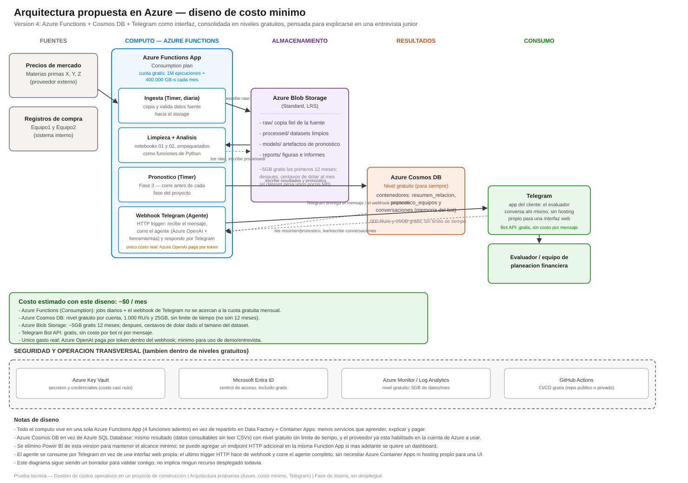

# Arquitectura propuesta — Azure (diseño de costo mínimo)

Diseño y documentación del entregable "Arquitectura propuesta en la nube" del caso. Es un **borrador de diseño**: por ahora no se despliega ningún recurso real en Azure, solo se documenta cómo se vería la solución completa en producción. El despliegue mínimo real queda para una siguiente etapa, una vez validado este planteamiento.

## Por qué esta versión

Este diseño se ha ido ajustando varias veces (el detalle de cada cambio está más abajo), siempre por dos motivos:

1. **Minimizar costo**: usar la mayor cantidad posible de niveles gratuitos de Azure en vez de servicios que cobran desde el primer uso.
2. **Ser defendible como candidato junior**: menos servicios distintos, cada uno con una razón concreta y fácil de explicar, en vez de una arquitectura "enterprise" con herramientas (Data Factory, Container Apps, orquestadores) que un junior normalmente no ha operado todavía. Reconocer que no hace falta esa complejidad para este volumen de datos es, en sí mismo, una señal de criterio.

Cambios respecto a la primera versión: se reemplazó Azure Data Factory + Azure Container Apps Jobs (dos servicios de cómputo distintos) por **una sola Azure Functions App** (con cuatro funciones adentro en ese momento; hoy son tres, ver el cambio v5 más abajo); se cambió Data Lake Storage Gen2 por **Blob Storage** normal (no se necesitan sus funciones de big data); y se quitó Power BI del alcance para no sumar un servicio que, para compartir tableros, requiere licencia Pro de pago.

Cambio adicional (v3): la base de resultados pasó de Azure SQL Database a **Azure Cosmos DB**, ambas gratuitas — el motivo no es de costo sino práctico: `Microsoft.DocumentDB` (el proveedor de Cosmos DB) ya está registrado en la suscripción de Azure que se va a usar para el despliegue real (por otros proyectos), mientras que `Microsoft.Sql` no — un paso menos de fricción al desplegar.

Cambio adicional (v4): el agente se consume por **Telegram** en vez de una interfaz web propia. Esto elimina Azure Container Apps del diseño por completo — no hace falta hospedar nada para la interfaz, porque la aplicación cliente ya es la propia app de Telegram (gratis) en el teléfono o computador de quien pregunta. La cuarta función de la Function App pasa de ser una API genérica a ser el webhook de Telegram, que además corre el agente completo.

Cambio adicional (v5): se elimina la función **Ingesta** como job separado con Timer. La razón es honesta, no de costo: nunca supimos cuál es la fuente real de precios nuevos de `X`, `Y`, `Z` (el caso entregó un histórico fijo, no una fuente en vivo, y no hay diccionario de datos que diga de dónde saldría la actualización). En vez de inventar una fuente externa que no podemos confirmar, la ingesta pasa a ser **conversacional**: alguien le reporta un precio al mismo bot de Telegram (`"X = 87.32"`), y el webhook toma la fecha automáticamente (del reloj del servidor, nunca se le pide al usuario ni al modelo que la escriba) y lo guarda como un dato nuevo, sin procesar todavía.

## Componentes, mapeados a lo que pide el caso

El caso pide que la arquitectura soporte: *ingesta y almacenamiento de datos, procesamiento analítico, ejecución del modelo y exposición de resultados*.

### Cómputo — una sola Azure Functions App (Consumption plan)

Las tres etapas de cómputo del proyecto viven en la **misma** Function App, como tres funciones separadas — un único recurso de Azure que desplegar y mantener:

- **Limpieza + Análisis** (Timer, diaria): la lógica de `01_limpieza_datos.ipynb` y `02_analisis_relacion_materias_primas_equipos.ipynb`, empaquetada como funciones de Python con las mismas dependencias de [requirements.txt](../requirements.txt) — corre sobre el histórico original **más** los precios nuevos que hayan llegado por Telegram desde la última corrida.
- **Pronóstico** (Timer): el modelo de la Fase 3, se reentrena antes de cada fase del proyecto.
- **Webhook de Telegram** (HTTP): el mismo código de `app/agente.py` y `app/tools.py` que ya probamos local, más una herramienta nueva para registrar precios (ver "Consumo" abajo). Telegram le hace un `POST` cada vez que alguien le escribe al bot; la función decide si es una pregunta (corre el agente completo: Azure OpenAI + herramientas) o un precio nuevo (lo valida y lo guarda), y contesta llamando a la API de Telegram. Es el único punto de la Function App con tráfico impredecible (depende de cuánto se use el bot), pero sigue siendo consumo bajo para una demo.

No hay una función "Ingesta" separada con Timer — reemplazada por el registro de precios vía Telegram, dentro del mismo webhook (ver "Por qué esta versión" arriba).

El plan **Consumption** de Azure Functions incluye una cuota gratuita mensual (1 millón de ejecuciones + 400.000 GB-s de cómputo) que se renueva cada mes, sin límite de tiempo. Los dos jobs diarios y una conversación de demo por Telegram no se acercan a ese límite — en la práctica, este componente cuesta **$0** (el único costo real que cuelga de aquí es Azure OpenAI, que se paga aparte, por token).

### Almacenamiento — Azure Blob Storage

Mismo esquema de carpetas que ya tiene este repo: `raw/` (copia fiel de la fuente), `processed/` (salidas de limpieza y análisis), `models/` (artefactos del pronóstico) y `reports/` (figuras e informes). `raw/` se carga **una sola vez**, a mano, con los archivos que ya vinieron con el caso — no hay una función que la actualice sola (ver el cambio de "Ingesta" más arriba); las actualizaciones después de esa carga inicial llegan por Telegram y quedan en Cosmos DB, no en `raw/`. Se usa Blob Storage estándar en vez de Data Lake Storage Gen2 porque no se necesita namespace jerárquico ni permisos a nivel de carpeta para este proyecto. Los primeros ~5GB son gratis durante 12 meses; después, dado que el dataset pesa unos pocos MB, el costo es de centavos de dólar al mes.

### Resultados — Azure Cosmos DB (nivel gratuito)

Dos contenedores documentales en vez de tablas relacionales, para no depender de leer CSVs en cada consulta:

- `resumen_relacion` — un documento por combinación materia prima–equipo (particionado por `equipo`), equivalente a `resumen_relacion_materias_primas_equipos.csv`.
- `pronostico_equipos` — un documento por fecha pronosticada (particionado por `equipo`), equivalente a `pronostico_equipos.csv`.
- `conversaciones` — un documento por `chat_id` de Telegram, con el historial de mensajes de esa conversación. Hace falta porque una Azure Function no mantiene estado entre invocaciones (a diferencia del prototipo local, que guarda la memoria en `st.session_state` mientras el proceso de Streamlit sigue corriendo) — el webhook lee este documento al recibir un mensaje y lo reescribe con la respuesta antes de terminar.
- `precios_reportados` — un documento por precio nuevo que alguien registre por Telegram (`insumo`, `precio`, `fecha` puesta por el servidor, `chat_id` de quien lo mandó). Es la "materia prima sin procesar" de las actualizaciones — la función de Limpieza + Análisis la lee junto con `raw/` en cada corrida, igual que este repo nunca edita a mano lo que ya está limpio.

Azure ofrece **1.000 RU/s y 25GB de almacenamiento gratis por cuenta, sin límite de tiempo** (a diferencia del storage, que solo es gratis 12 meses) — de sobra para el volumen de este proyecto. Se prefirió sobre Azure SQL Database porque el patrón de acceso (leer un documento pequeño por clave `equipo`) encaja igual de bien con un modelo de documentos, y porque el proveedor de Cosmos DB ya está habilitado en la cuenta de Azure que se va a usar (ver "Por qué esta versión" arriba).

### Consumo — Telegram

El evaluador (o el equipo de planeación financiera) habla con el bot como hablaría con cualquier contacto de Telegram — no hay una URL que visitar, ni una interfaz que mantener funcionando:

- **Telegram Bot API**: gratis, sin costo por bot ni por mensaje. El bot se crea una sola vez hablando con `@BotFather` dentro de Telegram, que entrega un token — eso es lo único manual del lado de Telegram.
- **Webhook, no *polling***: en vez de que nuestra función esté preguntando todo el rato "¿hay mensajes nuevos?" (lo que sí hace el prototipo local, con *long polling*, para no depender de una URL pública), en producción Telegram llama directo a la función cada vez que hay un mensaje nuevo — más eficiente y más barato, encaja mejor con un modelo serverless que paga por ejecución.
- **Ya probado en local** con datos y modelo reales (ver `app/README.md`) — pasar de local a este diseño es cambiar de dónde saca el `chat_id`/mensaje (input en consola → payload del webhook) y de dónde saca la memoria (variable en memoria → contenedor `conversaciones` de Cosmos DB), sin tocar la lógica del agente en sí.

**Registrar un precio nuevo también es una conversación**, no un formulario aparte: alguien le escribe al bot algo como *"X = 87.32"* y el agente reconoce la intención (una herramienta nueva, `registrar_precio_insumo`) en vez de tratarlo como una pregunta. Dos reglas de diseño, pensadas para no repetir errores que ya vimos en este proyecto:

- **La fecha nunca la escribe una persona ni la inventa el modelo** — la pone el código, con la fecha real del servidor en el momento del mensaje. Evita tanto errores de tipeo como que el modelo alucine una fecha.
- **Validación contra saltos anómalos**: mismo umbral del 15% que ya se usó en la Fase 1 para detectar saltos de precio inusuales. Si el precio reportado se aleja más de eso del último conocido, el agente no lo guarda de una — le pregunta a quien escribió si está seguro, igual que un analista dudaría antes de aceptar un dato así.
- **Control de acceso pendiente de decidir**: por ahora cualquiera que encuentre el bot podría, en teoría, reportar un precio falso y contaminar el dataset — antes de desplegar, hay que restringir esta herramienta a una lista de `chat_id` autorizados (guardada en Key Vault o en el propio Cosmos DB).

Power BI y una interfaz web propia quedan fuera de esta versión — si más adelante hace falta un dashboard visual, se puede agregar un endpoint HTTP adicional en la misma Function App sin rehacer nada de esto.

## Seguridad y operación transversal

También elegidos por su nivel gratuito:

- **Azure Key Vault** — secretos y credenciales (incluido el token del bot de Telegram y la key de Azure OpenAI); costo casi nulo a este volumen de operaciones.
- **Microsoft Entra ID** — control de acceso, incluido sin costo adicional en cualquier suscripción de Azure.
- **Azure Monitor / Log Analytics** — nivel gratuito de 5GB de datos de logs al mes.
- **GitHub Actions** (en vez de Azure DevOps) — CI/CD gratis para repositorios públicos o privados, y ya es donde vive el código.

## Costo estimado total

**~$0/mes** dentro del uso esperado de este proyecto: el cómputo (Functions, incluido el webhook de Telegram), la base de datos (Cosmos DB) y la interfaz (Telegram Bot API) caen dentro de niveles siempre-gratuitos, y el storage es gratis los primeros 12 meses (después, centavos). El único gasto real de todo el diseño es Azure OpenAI, que paga por uso de tokens — y aun así, mínimo para una demo.

## Qué queda pendiente

- Validar este planteamiento contigo antes de pasarlo al informe.
- Crear el bot en Telegram (hablar con `@BotFather`, elegir nombre y obtener el token) — es un paso manual tuyo, nadie más puede hacerlo por vos.
- Decidir y construir el control de acceso de `registrar_precio_insumo` (lista de `chat_id` autorizados) antes de desplegar — sin eso, cualquiera podría escribirle al bot un precio falso.
- Revisar si conviene acotar el uso de tokens de Azure OpenAI (ej. límites de contexto, cachear respuestas) para mantener ese único costo lo más bajo posible.
- Despliegue mínimo real (ej. la Function App + Blob Storage + registrar el webhook con Telegram) para capturar el punto adicional que ofrece el caso por resolverlo en una nube — pendiente de tu confirmación, ya que implica usar una suscripción de Azure real.
