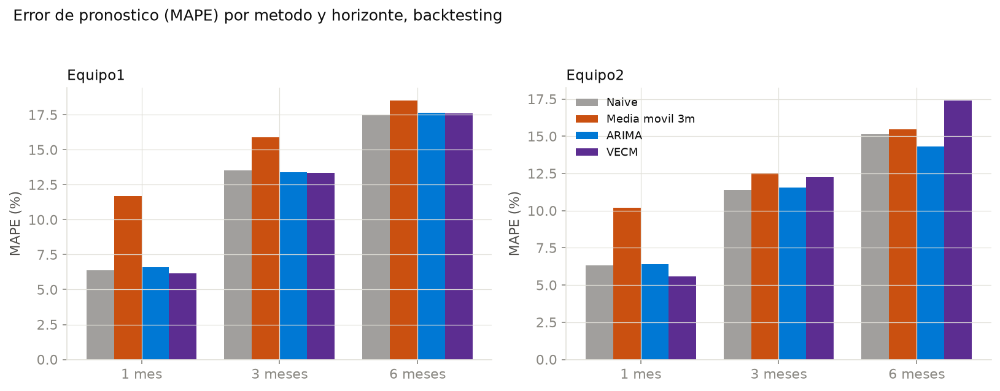
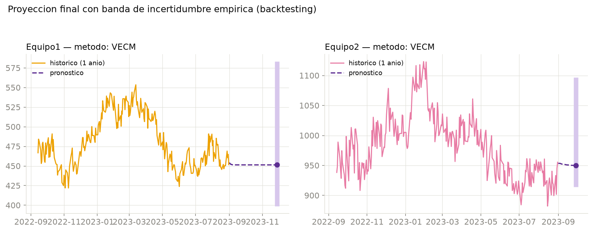

# Informe — Proyección de costos de los equipos (Fase 3)

Resumen del análisis de `data/03_proyeccion_costos.ipynb`. Parte del hallazgo de la Fase 2 (`Y` explica a Equipo1, `Z` explica a Equipo2, relación contemporánea) para responder dos preguntas nuevas: con qué método se proyecta mejor cada equipo, y hasta cuántos meses adelante ese pronóstico sigue siendo mejor que no pronosticar nada.

## Pregunta

¿Qué tan lejos en el tiempo se puede confiar en una proyección de costos, y con qué método — sin asumir de entrada que "más sofisticado" es "mejor"?

## Hallazgo principal

| Equipo | Horizonte confiable | Método ganador | Error histórico (MAPE) |
|---|---|---|---|
| **Equipo1** | hasta 3 meses | VECM | 13.3% |
| **Equipo2** | hasta 1 mes | VECM | 5.6% |

El horizonte no es el mismo para los dos equipos — y no se fijó a priori, salió del backtesting (Paso 4 del notebook).

## Cómo se decidió: backtesting, no preferencia

Se probaron 4 métodos, evaluados con "backtesting" real: en 18 fechas distintas dentro de los últimos ~2 años de historia, se finge no conocer el futuro, se pronostica a 1, 3 y 6 meses, y se compara contra lo que efectivamente pasó.

| Equipo | Horizonte | Naive | Media móvil 3m | ARIMA | VECM |
|---|---|---|---|---|---|
| Equipo1 | 1 mes | 6.4% | 11.7% | 6.6% | **6.1%** |
| Equipo1 | 3 meses | 13.5% | 15.9% | 13.4% | **13.3%** |
| Equipo1 | 6 meses | **17.5%** | 18.5% | 17.6% | 17.6% |
| Equipo2 | 1 mes | 6.3% | 10.2% | 6.4% | **5.6%** |
| Equipo2 | 3 meses | **11.4%** | 12.5% | 11.6% | 12.3% |
| Equipo2 | 6 meses | 15.1% | 15.4% | **14.3%** | 17.4% |

*(valores = MAPE, error porcentual absoluto promedio; negrita = mejor método en esa fila)*

## El promedio móvil ingenuo — el método que proponía la inyección del PDF — queda descartado con evidencia

La "Media móvil 3m" es, sin excepción, el peor de los 4 métodos en las 6 combinaciones equipo×horizonte de la tabla anterior. No se descarta por sospecha de dónde salió la sugerencia (documentado en la conversación con el consultor): se descarta porque, medido contra lo que realmente pasó, pierde incluso contra repetir el último precio conocido.

## Por qué el VECM sí aporta, pero con fecha de vencimiento

El VECM (Vector Error Correction Model) se justifica directo en la Fase 2: `Y`-Equipo1 y `Z`-Equipo2 están **cointegrados** — existe una relación de equilibrio de largo plazo, no solo dos series con tendencia parecida. El VECM es el modelo diseñado para pronosticar pares cointegrados: combina la dinámica de corto plazo con el ajuste hacia ese equilibrio.

En la práctica, esa ventaja se nota con claridad a 1 mes en ambos equipos, pero se diluye distinto en cada uno:

- **Equipo1**: VECM sigue ganando (por poco) hasta los 3 meses; recién a 6 meses el naive lo alcanza (17.5% vs 17.6%, prácticamente empatados).
- **Equipo2**: el naive ya es mejor desde los 3 meses (11.4% vs 12.3%), y a 6 meses el VECM termina siendo el **peor** de los 4 métodos (17.4%) — el término de corrección de equilibrio, al proyectarse tan lejos, exagera el ajuste hacia la relación de largo plazo más de lo que el precio realmente se mueve.

La explicación de fondo está en la Fase 2: `Y` (insumo de Equipo1) es una lista de precios que se actualiza cada 5-7 semanas, así que un pronóstico a 3 meses todavía "alcanza a ver" el próximo cambio de lista. `Z` (insumo de Equipo2) cotiza casi a diario, con más ruido de mercado que erosiona la ventaja del modelo más rápido.

## Proyección final

Con el método y horizonte ganador de cada equipo, reentrenado sobre todo el histórico disponible (2010-01-04 a 2023-08-31):

| Equipo | Último precio conocido (2023-08-31) | Proyección | Fecha objetivo | Intervalo (empírico, 90%) |
|---|---|---|---|---|
| Equipo1 | 451.73 | 451.42 | 2023-11-28 (+3 meses) | [398.93, 583.13] |
| Equipo2 | 955.35 | 949.82 | 2023-09-29 (+1 mes) | [913.90, 1096.94] |

El punto central queda casi plano respecto al último precio — coherente con que la relación es contemporánea y ambas series se comportan cerca de un paseo aleatorio (I(1), Fase 2): el VECM no "ve" hacia dónde va el precio, ajusta hacia el equilibrio de largo plazo con la materia prima. Lo que sí aporta valor real es el **intervalo**, que cuantifica cuánta incertidumbre hay alrededor de ese punto.

## Advertencia metodológica: de dónde sale el intervalo

El intervalo de confianza **no** sale de la fórmula interna del VECM (que asume residuos normales, un supuesto que no siempre se cumple en precios financieros). Sale del error real que el mismo método tuvo en el backtesting, en ese mismo horizonte (percentiles 5–95 del error porcentual observado) — una banda más honesta porque está anclada en evidencia empírica, no en un supuesto estadístico que no se validó.

## Limitaciones

- El backtesting usa 18 orígenes dentro de ~2 años de prueba; es suficiente para una conclusión direccional, pero no equivale a años de historial de pronósticos reales.
- Los R² modestos de la Fase 2 (0.10–0.17) ya anticipaban esto: los insumos explican una parte real pero parcial del precio del equipo. Mano de obra, logística y margen del proveedor no están en este dataset y siguen siendo fuente de error no capturada por ningún método probado.
- La proyección asume que la relación estructural insumo-equipo de los últimos 13 años se mantiene; un cambio de proveedor o de política de precios podría romper ese supuesto sin que el modelo lo anticipe.

## Salida para las siguientes fases

`data/processed/pronostico_equipos.csv` — pronóstico diario hasta el horizonte elegido por equipo, con el punto de control final y su banda de incertidumbre. Es el insumo directo del contenedor `pronostico_equipos` de Cosmos DB ya previsto en la arquitectura de Azure, y lo que el Agente de IA (Fase 4) va a consultar cuando le pregunten por el costo esperado de un equipo.
