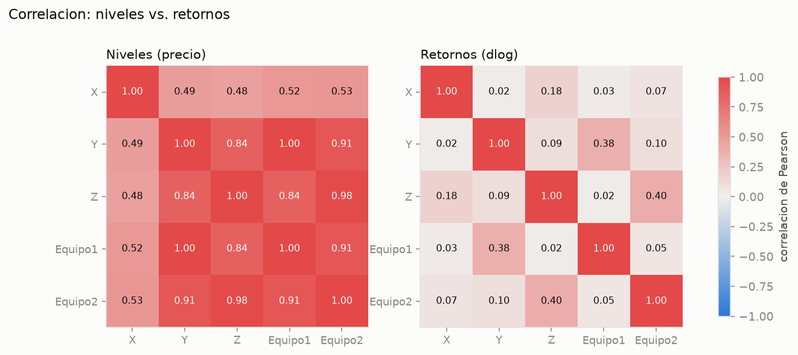
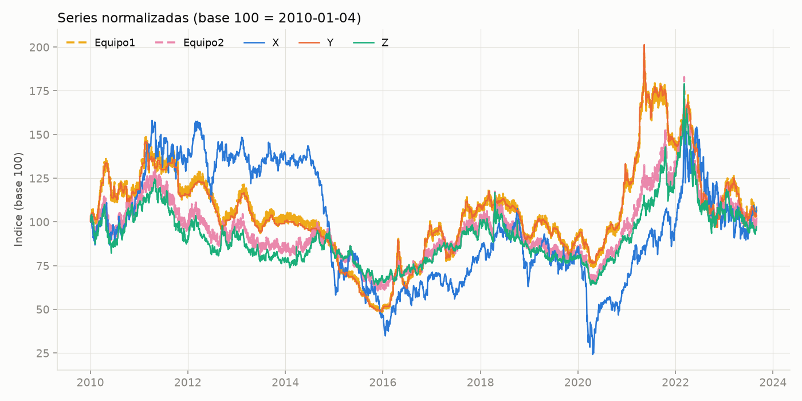
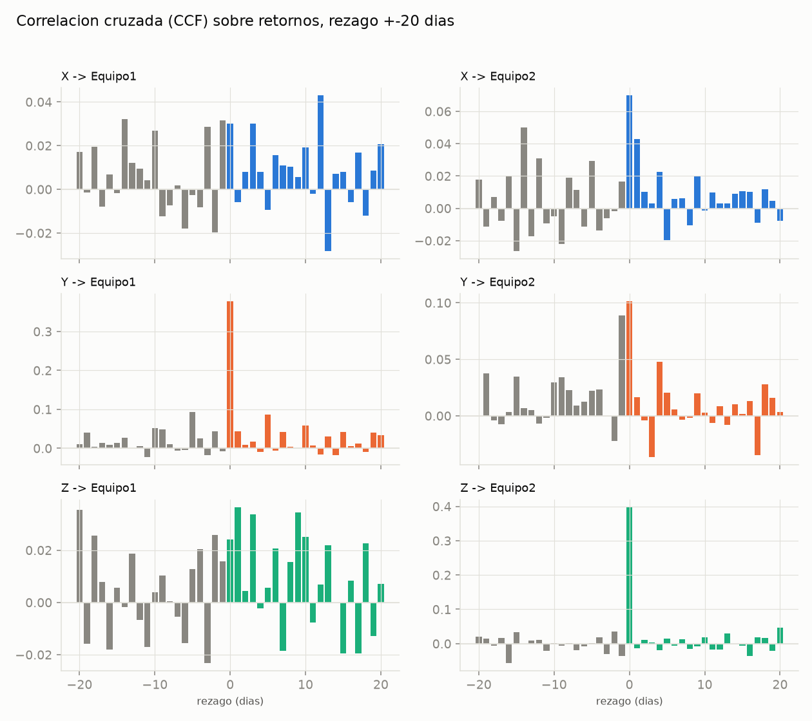
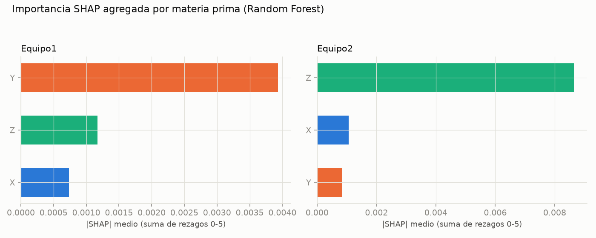

# Informe — Relación entre materias primas y precio de los equipos

Resumen del análisis de `data/02_analisis_relacion_materias_primas_equipos.ipynb`. Cubre 2010-01-04 a 2023-08-31 (3530 observaciones diarias), 3 materias primas (`X`, `Y`, `Z`) y 2 equipos de construcción.

## Pregunta

¿Qué materia prima explica el precio de cada equipo, con qué rezago, y es una relación real de largo plazo o solo dos series con tendencia que suben juntas (correlación espuria)?

## Hallazgo principal

| Equipo | Insumo relevante | Rezago | Cointegra | Correlación en retornos |
|---|---|---|---|---|
| **Equipo1** | `Y` | 0 (contemporáneo) | Sí (p = 0.005) | 0.38 |
| **Equipo2** | `Z` | 0 (contemporáneo) | Sí (p = 0.002) | 0.40 |

`X` juega un papel marginal en ambos equipos: no cointegra con ninguno (p = 0.46 y 0.39), su correlación en retornos es casi nula (0.03–0.07) y tiene la menor importancia en todos los modelos.

Cinco métodos independientes (Engle-Granger, vector de Johansen, correlación cruzada, Lasso/Elastic Net y Random Forest + SHAP) coinciden en esta misma conclusión.

## Por qué no basta con correlacionar precios crudos

Las 5 series son no estacionarias en niveles (I(1)) y estacionarias en retornos (I(0)) — confirmado con ADF y KPSS. Esto significa que la correlación en niveles está inflada por la tendencia compartida, no por una relación real:

| Par | Correlación en niveles | Correlación en retornos |
|---|---|---|
| Y – Equipo1 | 0.997 | 0.38 |
| Z – Equipo2 | 0.98 | 0.40 |
| X – equipos | 0.48 – 0.53 | 0.02 – 0.07 |

`X` es el caso más claro del problema: parece relevante en niveles y deja de estarlo casi por completo en retornos.

## Un detalle que condiciona la interpretación

`Y` es un precio "pegado": repite el valor del día anterior en el 55% de las observaciones (rachas de hasta 35 días hábiles), típico de una lista de precios que se actualiza periódicamente, no de una cotización diaria de mercado. Como `Y` es justamente el insumo que domina el precio de Equipo1, esto se interpreta mejor como que **Equipo1 está indexado o referenciado a la lista de precios de Y**, más que como una transmisión de precio vía mercado día a día. `X` y `Z` sí cotizan casi a diario.

## La relación es del mismo día, no anticipable

La correlación cruzada (retornos, ±20 días hábiles) muestra un pico dominante en rezago 0 para `Y → Equipo1` y `Z → Equipo2`, sin ningún rezago que se distinga del ruido para `X`:

La causalidad de Granger sale "significativa" en las 6 combinaciones al 5%, pero con ~3500 observaciones el test tiene mucha potencia estadística — hasta el efecto pequeño de `X` da p-valor bajo. Por eso la magnitud (CCF, coeficientes) pesa más que la significancia sola.

## Cuantificación y contraste no lineal

Lasso y Elastic Net (validados con `TimeSeriesSplit`, sin fuga de información temporal) concentran casi todo el coeficiente en un solo rezago por equipo (`Y_lag0` y `Z_lag0`). Un Random Forest + SHAP confirma el mismo orden de importancia por una vía no lineal:

Los R² de todos los modelos son modestos (0.10–0.17): estos insumos explican una parte real pero parcial del precio del equipo — quedan fuera mano de obra, logística y margen, que no están en este dataset.

## Advertencia metodológica: Johansen

El test de Johansen (sistema `X, Y, Z, Equipo_i`) sugiere cointegración de rango completo, lo cual contradice tanto la estacionariedad individual (Paso 1) como el propio Engle-Granger (`X` no cointegra). No se toma al pie de la letra: es un patrón conocido cuando hay heterocedasticidad (volatility clustering) en series financieras diarias con muestras grandes, que infla el estadístico. Se usa solo como evidencia secundaria — y aun así, su vector de cointegración apunta a la misma variable dominante que el resto del análisis (`Y` para Equipo1, `Z` para Equipo2).

## Conclusión para la Fase 3 (forecasting)

La tabla completa está en `data/processed/resumen_relacion_materias_primas_equipos.csv`. Para modelar cada equipo, el insumo a incluir es:

- **Equipo1**: `Y`, rezago 0.
- **Equipo2**: `Z`, rezago 0.

`X` puede excluirse o dejarse como variable de control de baja prioridad en ambos casos.
